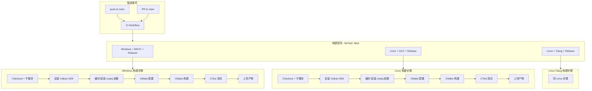
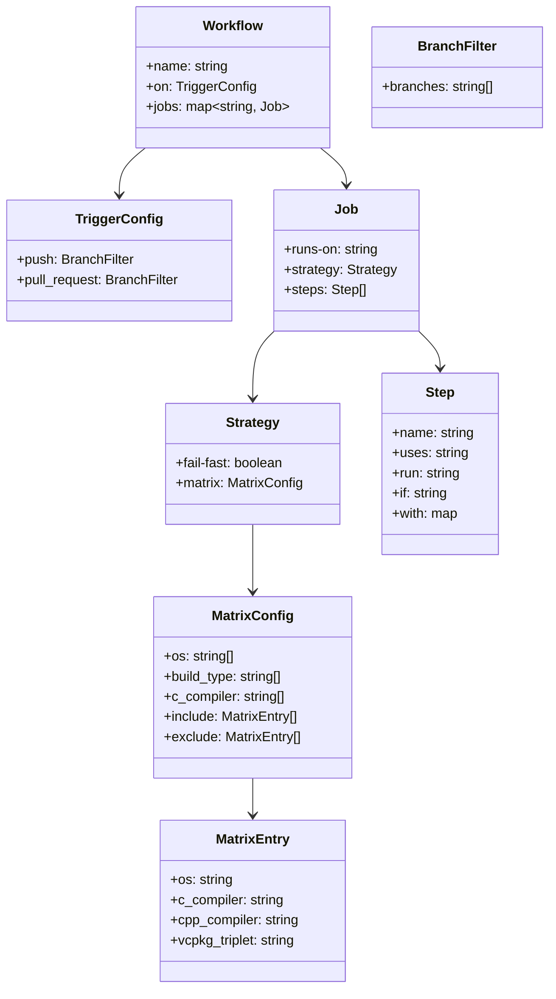

# 设计文档

## 概述

本设计为 cyVulkanNanite 项目构建完善的 GitHub Actions CI 流水线，替换现有的模板化工作流 `cmake-multi-platform.yml`。现有工作流缺少 Vulkan SDK 安装、vcpkg 依赖管理、子模块检出、缓存优化和构建产物上传等关键功能，导致构建无法在干净的 CI 环境中成功完成。

新的 CI 工作流将：
- 支持 Windows（MSVC）和 Linux（GCC、Clang）三种编译器组合的 Release 构建
- 自动安装 Vulkan SDK、通过 vcpkg 安装 OpenMesh 和 METIS、检出 Git 子模块
- 缓存 vcpkg 依赖以加速重复构建
- 通过 CTest 运行 `nanite_tests` 测试套件（GTest + RapidCheck）
- 上传构建产物并设置 7 天保留期

## 架构



设计决策：
- 使用单个 workflow 文件 `.github/workflows/ci.yml` 替换现有的 `cmake-multi-platform.yml`，保持简洁
- `fail-fast: false` 确保一个矩阵组合失败不影响其他组合的反馈
- vcpkg 以 Git 子模块或直接 clone 的方式集成，使用 `VCPKG_ROOT` 环境变量和工具链文件
- Windows 使用 `x64-windows-static` triplet，与现有 `build_windows.bat` 保持一致
- Linux 使用默认的 `x64-linux` triplet
- Vulkan SDK 通过官方安装脚本/包安装，不通过 vcpkg

## 组件与接口

### 1. 工作流文件（.github/workflows/ci.yml）

主要的 CI 配置文件，定义完整的构建流水线。

#### 触发条件
```yaml
on:
  push:
    branches: [ "main" ]
  pull_request:
    branches: [ "main" ]
```

#### 构建矩阵
```yaml
strategy:
  fail-fast: false
  matrix:
    os: [ubuntu-latest, windows-latest]
    build_type: [Release]
    c_compiler: [gcc, clang, cl]
    include:
      - os: windows-latest
        c_compiler: cl
        cpp_compiler: cl
        vcpkg_triplet: x64-windows-static
      - os: ubuntu-latest
        c_compiler: gcc
        cpp_compiler: g++
        vcpkg_triplet: x64-linux
      - os: ubuntu-latest
        c_compiler: clang
        cpp_compiler: clang++
        vcpkg_triplet: x64-linux
    exclude:
      - os: windows-latest
        c_compiler: gcc
      - os: windows-latest
        c_compiler: clang
      - os: ubuntu-latest
        c_compiler: cl
```

### 2. 代码检出与子模块

使用 `actions/checkout@v4`，启用 `submodules: recursive` 以递归检出 `external/glm` 和 `assets`（Vulkan-Assets）。

```yaml
- uses: actions/checkout@v4
  with:
    submodules: recursive
```

### 3. Vulkan SDK 安装


**Linux**：通过 LunarG 官方 APT 仓库安装 Vulkan SDK。

```yaml
- name: Install Vulkan SDK (Linux)
  if: runner.os == 'Linux'
  run: |
    wget -qO- https://packages.lunarg.com/lunarg-signing-key-pub.asc | sudo tee /etc/apt/trusted.gpg.d/lunarg.asc
    sudo wget -qO /etc/apt/sources.list.d/lunarg-vulkan-jammy.list https://packages.lunarg.com/vulkan/lunarg-vulkan-jammy.list
    sudo apt-get update
    sudo apt-get install -y vulkan-sdk
```

**Windows**：使用官方 `install-vulkan-sdk` Action 或通过 Chocolatey 安装。推荐使用社区维护的 Action `humbletim/install-vulkan-sdk@v1.1.1`。

```yaml
- name: Install Vulkan SDK (Windows)
  if: runner.os == 'Windows'
  uses: humbletim/install-vulkan-sdk@v1.1.1
  with:
    version: latest
    cache: true
```

### 4. vcpkg 依赖管理与缓存

vcpkg 在 CI 中通过 clone 官方仓库并使用 `actions/cache` 缓存已安装的包。

**缓存策略**：
- 缓存键基于操作系统、vcpkg triplet 和安装的包列表的哈希值
- 缓存路径为 `$VCPKG_ROOT/installed` 目录
- 当包列表或 triplet 变化时缓存自动失效

```yaml
- name: Setup vcpkg
  run: |
    git clone https://github.com/Microsoft/vcpkg.git ${{ github.workspace }}/vcpkg
    ${{ github.workspace }}/vcpkg/bootstrap-vcpkg.sh  # Linux
    # 或 ${{ github.workspace }}/vcpkg/bootstrap-vcpkg.bat  # Windows

- name: Cache vcpkg packages
  uses: actions/cache@v4
  with:
    path: ${{ github.workspace }}/vcpkg/installed
    key: vcpkg-${{ matrix.os }}-${{ matrix.vcpkg_triplet }}-openmesh-metis-${{ hashFiles('.github/workflows/ci.yml') }}
    restore-keys: |
      vcpkg-${{ matrix.os }}-${{ matrix.vcpkg_triplet }}-

- name: Install vcpkg packages
  run: |
    ${{ github.workspace }}/vcpkg/vcpkg install openmesh:${{ matrix.vcpkg_triplet }} metis:${{ matrix.vcpkg_triplet }}
```

### 5. CMake 配置与构建

```yaml
- name: Configure CMake
  run: >
    cmake -B build
    -DCMAKE_BUILD_TYPE=${{ matrix.build_type }}
    -DCMAKE_C_COMPILER=${{ matrix.c_compiler }}
    -DCMAKE_CXX_COMPILER=${{ matrix.cpp_compiler }}
    -DCMAKE_TOOLCHAIN_FILE=${{ github.workspace }}/vcpkg/scripts/buildsystems/vcpkg.cmake
    -DVCPKG_TARGET_TRIPLET=${{ matrix.vcpkg_triplet }}
    -DBUILD_TESTING=ON

- name: Build
  run: cmake --build build --config ${{ matrix.build_type }}
```

Windows 上 MSVC 使用多配置生成器（Visual Studio），`--config Release` 参数确保构建正确的配置。

### 6. 测试执行

```yaml
- name: Run Tests
  working-directory: build
  run: ctest --build-config ${{ matrix.build_type }} --verbose --output-on-failure --timeout 300
```

- `--verbose`：输出每个测试用例的执行结果
- `--output-on-failure`：仅在失败时输出详细日志
- `--timeout 300`：单个测试超时 5 分钟

### 7. 构建产物上传

```yaml
- name: Upload Build Artifacts
  uses: actions/upload-artifact@v4
  with:
    name: build-${{ matrix.os }}-${{ matrix.c_compiler }}-${{ matrix.build_type }}
    path: build/bin/
    retention-days: 7
```

每个矩阵组合生成独立命名的产物，格式为 `build-{os}-{compiler}-{build_type}`。

## 数据模型

### 工作流配置结构

CI 工作流本身不涉及应用层数据模型，其核心"数据"是 YAML 配置结构：



### 构建矩阵实例

| 组合 | OS | C 编译器 | C++ 编译器 | vcpkg Triplet | 构建类型 |
|------|-----|---------|-----------|---------------|---------|
| 1 | windows-latest | cl | cl | x64-windows-static | Release |
| 2 | ubuntu-latest | gcc | g++ | x64-linux | Release |
| 3 | ubuntu-latest | clang | clang++ | x64-linux | Release |

### 缓存键结构

| 缓存项 | 键格式 | 失效条件 |
|--------|--------|---------|
| vcpkg 包 | `vcpkg-{os}-{triplet}-openmesh-metis-{workflow_hash}` | 工作流文件变更 |


## 正确性属性

*属性（Property）是在系统所有有效执行中都应成立的特征或行为——本质上是对系统应做什么的形式化陈述。属性是人类可读规范与机器可验证正确性保证之间的桥梁。*

### 分析

本功能的核心产出是一个 GitHub Actions 工作流 YAML 文件。与应用代码不同，CI 工作流是静态配置而非处理可变输入的函数。因此：

- 所有验收标准都是对 YAML 结构的静态验证（example-based），而非跨输入空间的通用属性（property-based）
- 运行时行为（如缓存命中跳过下载、步骤失败终止构建）由 GitHub Actions 平台保证，不在我们的测试范围内
- 适合使用 YAML 解析 + 结构断言的方式验证

由于所有可测试的验收标准均为 example 类型（验证单个静态配置文件的结构），本功能不包含适合属性测试（property-based testing）的正确性属性。所有验证通过单元测试/结构测试完成。

## 错误处理

### 工作流层面

| 错误场景 | 处理方式 | 对应需求 |
|---------|---------|---------|
| 矩阵中某组合构建失败 | `fail-fast: false`，其余组合继续执行 | 1.5 |
| Vulkan SDK 安装失败 | 步骤返回非零退出码，GitHub Actions 自动终止 job | 2.5 |
| vcpkg 包安装失败 | 步骤返回非零退出码，GitHub Actions 自动终止 job | 2.5 |
| Git 子模块检出失败 | `actions/checkout` 返回失败，job 终止 | 7.2 |
| CMake 配置失败 | 步骤返回非零退出码，完整错误日志输出到 Actions 日志 | 4.5 |
| CMake 构建失败 | 步骤返回非零退出码，job 标记为失败 | - |
| CTest 测试失败 | CTest 返回非零退出码，job 标记为失败 | 5.3 |
| CTest 测试超时 | `--timeout 300` 参数终止超时测试 | 5.4 |

### 缓存层面

- 缓存未命中时自动回退到完整安装流程，不影响构建正确性
- 缓存键包含工作流文件哈希，工作流变更自动触发缓存失效
- `restore-keys` 提供前缀匹配的降级缓存，减少完全缓存未命中的概率

## 测试策略

### 测试方法

由于 CI 工作流是静态 YAML 配置，测试策略以结构验证为主：

**YAML 结构验证（单元测试）**：
- 解析 `.github/workflows/ci.yml` 并验证关键结构
- 验证构建矩阵包含预期的 3 个 OS/编译器组合（需求 1.1）
- 验证触发条件包含 push 和 pull_request 到 main（需求 1.2, 1.3）
- 验证 `fail-fast: false` 设置（需求 1.5）
- 验证存在 Vulkan SDK 安装步骤（需求 2.1, 2.2）
- 验证存在 vcpkg 安装步骤且包含 openmesh 和 metis（需求 2.3）
- 验证 checkout 步骤启用 `submodules: recursive`（需求 2.4, 7.1）
- 验证存在 `actions/cache` 步骤（需求 3.1）
- 验证缓存键包含哈希函数（需求 3.2）
- 验证 CMake 配置传递正确参数（需求 4.1-4.4）
- 验证 CTest 步骤包含 `--verbose` 和 `--timeout`（需求 5.1, 5.2, 5.4）
- 验证存在 `upload-artifact` 步骤且 `retention-days: 7`（需求 6.1-6.3）

**集成验证（手动/CI 自身）**：
- 实际推送代码或创建 PR 后观察 GitHub Actions 运行结果
- 验证所有 3 个矩阵组合均成功完成
- 验证构建产物可下载
- 验证缓存在第二次运行时命中

### 属性测试

本功能不包含属性测试。CI 工作流是静态配置，不存在需要跨输入空间验证的通用属性。所有验证通过结构化的单元测试完成。

### 测试工具

- YAML 解析：可使用 Python `pyyaml` 或 Node.js `js-yaml` 解析工作流文件
- 或者直接通过人工审查和 CI 实际运行来验证
- 推荐在 CI 工作流本身成功运行后，视为集成测试通过

