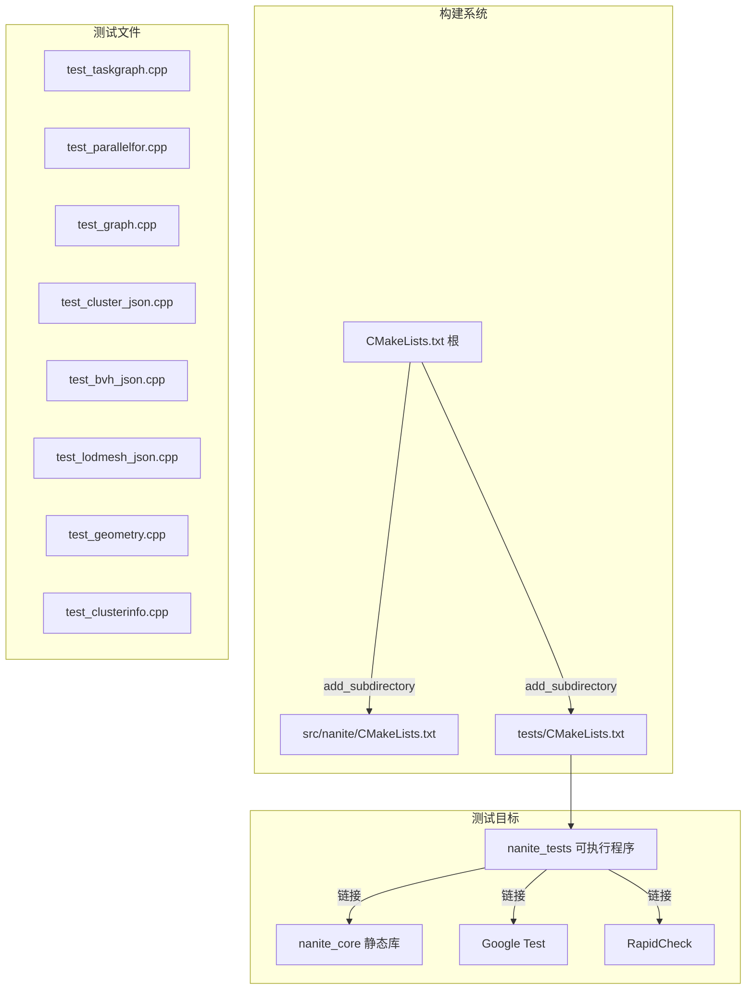
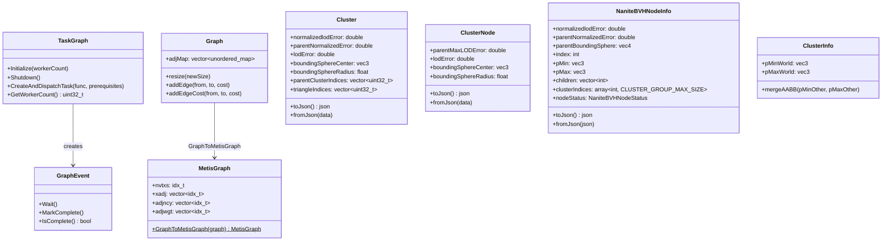

# 设计文档

## 概述

本设计为 cyVulkanNanite 项目的 Nanite 核心模块引入自动化测试框架。测试目标覆盖 TaskGraph 任务调度系统、Nanite 几何处理数据结构（Graph、MetisGraph）、JSON 序列化往返（Cluster、ClusterNode、NaniteBVHNodeInfo、NaniteLodMesh）、几何工具函数（AABB 计算）以及 ClusterInfo AABB 合并逻辑。

测试框架基于 Google Test，通过独立的 `tests/` 目录和 CMake `add_subdirectory` 集成到现有构建系统。测试可执行程序 `nanite_tests` 链接 `nanite_core` 静态库，不依赖 Vulkan 运行时环境，可在 CI 环境中独立编译和运行。

属性测试（Property-Based Testing）使用 [RapidCheck](https://github.com/emil-e/rapidcheck) 库，它与 Google Test 无缝集成，支持自定义生成器和缩减策略。

## 架构



设计决策：
- 选择 Google Test 作为单元测试框架，因为它是 C++ 生态中最成熟的测试框架，vcpkg 直接支持
- 选择 RapidCheck 作为属性测试库，因为它原生支持 Google Test 集成（`rc/gtest.h`），且支持 `glm::vec3`、`std::vector` 等类型的自定义 `Arbitrary` 特化
- 测试目录独立于 `src/`，避免污染生产代码结构
- 所有测试通过 `ctest` 统一运行，也可直接执行 `nanite_tests` 二进制

## 组件与接口

### 1. CMake 集成（tests/CMakeLists.txt）

- 使用 `FetchContent` 或 `find_package` 引入 Google Test 和 RapidCheck
- 创建 `nanite_tests` 可执行目标，链接 `nanite_core`、`GTest::gtest_main`、`rapidcheck`
- 注册 `gtest_discover_tests(nanite_tests)` 以支持 `ctest`
- 不链接 Vulkan 库，确保无 GPU 依赖

### 2. 测试文件组织

| 文件 | 测试范围 | 类型 |
|------|---------|------|
| `test_taskgraph.cpp` | TaskGraph 生命周期、初始化/关闭 | 单元测试 |
| `test_parallelfor.cpp` | ParallelFor 正确性 | 单元测试 + 属性测试 |
| `test_graph.cpp` | Graph、MetisGraph 数据结构 | 单元测试 + 属性测试 |
| `test_cluster_json.cpp` | Cluster、ClusterNode JSON 往返 | 属性测试 |
| `test_bvh_json.cpp` | NaniteBVHNodeInfo JSON 往返 | 属性测试 |
| `test_lodmesh_json.cpp` | NaniteLodMesh JSON 往返 | 属性测试 |
| `test_geometry.cpp` | getTriangleAABB | 属性测试 |
| `test_clusterinfo.cpp` | ClusterInfo::mergeAABB | 属性测试 |

### 3. RapidCheck 自定义生成器

需要为以下类型实现 `rc::Arbitrary` 特化：

- `glm::vec3`：生成随机 3D 向量（合理浮点范围，避免 NaN/Inf）
- `glm::vec4`：生成随机 4D 向量
- `Nanite::Cluster`：生成有效的 Cluster 对象（合理的索引、误差值、包围球）
- `Nanite::ClusterNode`：生成有效的 ClusterNode 对象
- `Nanite::NaniteBVHNodeInfo`：生成有效的 BVH 节点信息
- `Nanite::NaniteLodMesh`：生成简化的 LodMesh 对象（仅包含序列化字段）

## 数据模型

### 测试中涉及的核心数据结构



### RapidCheck 生成器约束

为确保生成的测试数据有效，生成器需遵循以下约束：

- 浮点值范围限制在 `[-1e6, 1e6]`，避免序列化精度问题
- `Cluster::triangleIndices` 和 `parentClusterIndices` 长度限制在 `[0, 128]`
- `NaniteBVHNodeInfo::children` 长度限制在 `[0, 16]`
- `NaniteBVHNodeInfo::nodeStatus` 从枚举有效值中随机选取
- `NaniteLodMesh` 生成器仅填充序列化相关字段（`clusterNum`、`triangleClusterIndex`、`clusterColorAssignment`、`clusters` 等）

## 正确性属性

*属性（Property）是在系统所有有效执行中都应成立的特征或行为——本质上是对系统应做什么的形式化陈述。属性是人类可读规范与机器可验证正确性保证之间的桥梁。*

### 属性 1：任务依赖执行顺序

*对于任意*的任务依赖链，当任务 B 依赖任务 A 的完成事件时，任务 A 的执行体应在任务 B 的执行体之前完成。通过记录每个任务的完成时间戳，依赖链中前置任务的时间戳应始终小于后续任务的时间戳。

**验证需求：3.2, 3.6**

### 属性 2：任务完成事件状态

*对于任意*通过 `CreateAndDispatchTask` 创建的任务，当任务执行完成后，其关联的 `GraphEvent` 的 `IsComplete()` 应返回 `true`。

**验证需求：3.3**

### 属性 3：ParallelFor 并行与顺序结果一致

*对于任意*正整数 `num` 和确定性函数 `body`，`ParallelFor(num, body)` 的并行执行结果应与在单线程上顺序执行 `body(0), body(1), ..., body(num-1)` 的结果完全一致。具体地，使用原子数组记录每个索引的执行次数，每个索引应恰好被执行一次。

**验证需求：4.1, 4.5**

### 属性 4：Graph::addEdge 记录边

*对于任意*有效的图大小 `n`、顶点对 `(from, to)` 其中 `from, to < n`、以及权重 `cost`，调用 `addEdge(from, to, cost)` 后，`adjMap[from][to]` 应等于 `cost`。

**验证需求：5.1**

### 属性 5：Graph::addEdgeCost 累加权重

*对于任意*已存在权重为 `w1` 的边 `(from, to)`，调用 `addEdgeCost(from, to, w2)` 后，`adjMap[from][to]` 应等于 `w1 + w2`。

**验证需求：5.2**

### 属性 6：GraphToMetisGraph CSR 格式有效性

*对于任意*有效的 `Graph` 对象，调用 `MetisGraph::GraphToMetisGraph(graph)` 后，生成的 MetisGraph 应满足：(1) `xadj.size() == nvtxs + 1`，(2) `adjncy.size() == adjwgt.size()`，(3) 对于每个顶点 `v`，`xadj[v+1] - xadj[v]` 应等于该顶点在原图中的邻居数量。

**验证需求：5.3, 5.4, 5.5**

### 属性 7：Cluster JSON 序列化往返

*对于任意*有效的 `Cluster` 对象，执行 `toJson()` 后再 `fromJson()` 应产生与原始对象等价的 `Cluster`，即 `normalizedlodError`、`parentNormalizedError`、`lodError`、`boundingSphereCenter`、`boundingSphereRadius`、`parentClusterIndices` 和 `triangleIndices` 字段均相等。

**验证需求：6.1, 6.4**

### 属性 8：ClusterNode JSON 序列化往返

*对于任意*有效的 `ClusterNode` 对象，执行 `toJson()` 后再 `fromJson()` 应产生与原始对象等价的 `ClusterNode`，即 `parentMaxLODError`、`lodError`、`boundingSphereCenter` 和 `boundingSphereRadius` 字段均相等。

**验证需求：6.2**

### 属性 9：NaniteBVHNodeInfo JSON 序列化往返

*对于任意*有效的 `NaniteBVHNodeInfo` 对象，执行 `toJson()` 后再 `fromJson()` 应产生与原始对象等价的 `NaniteBVHNodeInfo`，包括所有 `CLUSTER_GROUP_MAX_SIZE` 个 `clusterIndices` 元素。

**验证需求：7.1, 7.3**

### 属性 10：NaniteLodMesh JSON 序列化往返

*对于任意*有效的 `NaniteLodMesh` 对象（仅包含序列化字段），执行 `toJson()` 后再 `fromJson()` 应产生与原始对象等价的 `NaniteLodMesh`，且反序列化后的 `clusters.size()` 等于 `clusterNum`。

**验证需求：8.1, 8.2, 8.3**

### 属性 11：getTriangleAABB 计算正确性

*对于任意*三个 3D 顶点 `p0`、`p1`、`p2`，`getTriangleAABB` 计算出的 `pMin` 的每个分量应等于三个顶点对应分量的最小值，`pMax` 的每个分量应等于三个顶点对应分量的最大值。

**验证需求：9.1, 9.2, 9.3**

### 属性 12：ClusterInfo::mergeAABB 单调包含性

*对于任意*序列的 AABB 合并操作，每次调用 `mergeAABB(pMinOther, pMaxOther)` 后，`ClusterInfo` 的 `pMinWorld` 的每个分量应小于等于合并前的值和 `pMinOther` 的对应分量，`pMaxWorld` 的每个分量应大于等于合并前的值和 `pMaxOther` 的对应分量。最终包围盒应包含所有已合并的包围盒。

**验证需求：10.1, 10.2, 10.3, 10.4**

## 错误处理

### 测试框架层面

- 测试中使用 `EXPECT_DEATH` 或 Google Test 的死亡测试机制验证 `NaniteAssert` 触发的断言失败（需求 6.3、7.2）
- RapidCheck 测试失败时自动输出最小化的反例（shrinking），便于调试
- 测试超时机制：TaskGraph 相关测试设置合理的超时时间，防止死锁导致测试挂起

### 被测代码层面

- `TaskGraph::Shutdown()` 在未初始化时安全返回（需求 2.5）
- `ParallelFor(num <= 0, ...)` 安全返回不执行（需求 4.2）
- `Cluster::fromJson()` 在缺少必要字段时触发 `NaniteAssert`（需求 6.3）
- `NaniteBVHNodeInfo::fromJson()` 在缺少必要字段时触发 `NaniteAssert`（需求 7.2）

## 测试策略

### 双重测试方法

本项目采用单元测试与属性测试互补的策略：

- **单元测试（Google Test）**：验证具体示例、边界条件和错误处理
  - TaskGraph 生命周期管理（初始化、关闭、幂等性）
  - ParallelFor 边界条件（num=0、forceSingleThread）
  - JSON 反序列化缺少字段时的断言失败
  - 退化三角形的 AABB 计算
  - 具体的任务依赖链场景

- **属性测试（RapidCheck）**：验证跨所有输入的通用属性
  - 所有 12 个正确性属性均通过 RapidCheck 实现
  - 每个属性测试运行至少 100 次迭代
  - 每个正确性属性由单个属性测试实现

### 属性测试库

使用 [RapidCheck](https://github.com/emil-e/rapidcheck)，通过 vcpkg 或 FetchContent 集成。

RapidCheck 与 Google Test 的集成方式：
```cpp
#include <rapidcheck.h>
#include <rapidcheck/gtest.h>

RC_GTEST_PROP(TestSuite, PropertyName, (args...)) {
    // 属性断言
    RC_ASSERT(condition);
}
```

### 属性测试标注格式

每个属性测试必须包含注释引用设计文档中的属性编号：

```cpp
// Feature: nanite-testing, Property 7: Cluster JSON 序列化往返
RC_GTEST_PROP(ClusterJsonTest, RoundTrip, ()) {
    auto cluster = *rc::gen::arbitrary<Nanite::Cluster>();
    auto json = cluster.toJson();
    Nanite::Cluster restored;
    restored.fromJson(json);
    RC_ASSERT(cluster.normalizedlodError == restored.normalizedlodError);
    // ...
}
```

### 测试配置

- 每个属性测试最少 100 次迭代（RapidCheck 默认即满足）
- TaskGraph 测试使用固定的 worker 数量（如 4）以确保可重复性
- JSON 往返测试的浮点比较使用近似相等（考虑 double→float 精度损失）
- 测试通过 `ctest` 或直接运行 `nanite_tests` 执行
