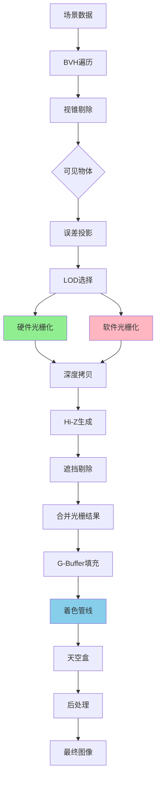

一个基于Vulkan的Nanite实现方式。
目前还在开发（摸鱼）中，争取2026.3结束。

# 构建

vcpkg_windows.bat拉取第三方库（vcpkg是个好东西，拉取第三方依赖比git external方便很多）。
build_windows.bat进行构建。

# 原理

# 参考资料

[【22.GPU驱动的几何管线-nanite (Part 1) | GAMES104-现代游戏引擎：从入门到实践】](https://www.bilibili.com/video/BV1Et4y1P7ro/?share_source=copy_web&vd_source=de7a08b4d347de57ea41a8ae39a04d3b)
[Epic演讲资料](https://advances.realtimerendering.com/s2021/Karis_Nanite_SIGGRAPH_Advances_2021_final.pdf)
