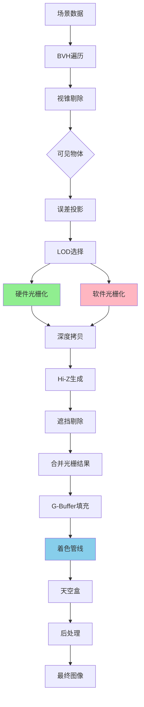

# cyVulkanNanite

基于 Vulkan 实现的 UE5 Nanite（虚拟几何体）系统，包含 GPU 驱动的 BVH 遍历、混合软硬光栅化、Hi-Z 遮挡剔除与 PBR/IBL 着色管线。

## Feature

- [x] mesh和lod生成
- [x] cluster and cluster group实现
- [x] bvh traversal
- [x] soft rasterization
- [x] hard rasterization
- [x] hiz
- [ ] Render Graph
  - [x] Render Graph实现-> 这里打算转为使用vulkan.hpp，重写一套底层，因为很多依赖都要修改，放弃对于vulkan example的依赖。
  - [ ] Render Graph已经实现，model，scene场景加载等需要重做，适配Nanite。
- [ ] 性能分析
  - [x] 性能分析功能开发
  - [ ] 等待接入。
- [x] mesh的Task Graph多线程处理
- [ ] 现在渲染出来的是没有颜色的，还有点麻烦，games104课程我记得后面有讲，可以看一下是怎么做的。
- [ ] GPU Driven Depth Culling
- [ ] 更好的内存对齐方式。
  - [x] 其实这里我的想法是能不能效仿asan，在最开始的代码中下毒，进行一个padding的验证，而且很麻烦的一点是cpu gpu没有对齐是没有任何warning的，vulkan validation layer对于这个没有任何防御方式
  - [ ] 对于内存对齐方式，参考LegitEngine的实现，强制使用unpack去做。
- [ ] GPU上的多线程并发优化
- [x] Test功能
- [ ] github action ci的接通
## TODO Fix Bug
- [x] 渲染出来没有几何细节，问题原因：CPU和GPU的内存对齐问题。
- [ ] 软光栅的代码好像没有跑到。
- [ ] bvh和error处理部分的渲染剔除模块有问题，导致在lod切换的时候会出现闪烁。
## Technology 

| 类别　　 | 技术　　　　　　　　　　　　　　　　　　　　|
| ----------| ---------------------------------------------|
| 图形 API | Vulkan 1.3　　　　　　　　　　　　　　　　　|
| 语言标准 | C++20　　　　　　　　　　　　　　　　　　　 |
| 着色器　 | GLSL 450+　　　　　　　　　　　　　　　　　 |
| 网格处理 | METIS 图分区、meshoptimizer 简化　　　　　　|
| 模型格式 | glTF 2.0　　　　　　　　　　　　　　　　　　|
| 构建系统 | CMake + vcpkg　　　　　　　　　　　　　　　 |
| 第三方库 | GLM, ImGui, tinygltf, KTX, stb, SPIRV-Cross |

## 渲染管线流程


```mermaid
graph TB
    A[场景数据] --> B[BVH遍历]
    B --> C[视锥剔除]
    C --> D{可见物体}

    D --> E[误差投影]
    E --> F[LOD选择]

    F --> G[硬件光栅化]
    F --> H[软件光栅化]

    G --> I[深度拷贝]
    H --> I
    I --> J[Hi-Z生成]

    J --> K[遮挡剔除]
    K --> L[合并光栅结果]

    L --> M[G-Buffer填充]
    M --> N[着色管线]
    N --> O[天空盒]
    O --> P[后处理]
    P --> Q[最终图像]

    style G fill:#90EE90
    style H fill:#FFB6C1
    style N fill:#87CEEB
```

## 项目结构

```
cyVulkanNanite/
├── base/                    # Vulkan 基础框架（设备、交换链、缓冲区、纹理等封装）
├── src/nanite/              # Nanite 核心算法
│   ├── Cluster.*            # Cluster 数据结构与构建
│   ├── ClusterGroup.*       # ClusterGroup + METIS 图分区
│   ├── NaniteMesh.*         # Nanite 网格管理（加载/序列化/反序列化）
│   ├── NaniteLodMesh.*      # LOD 处理（简化、BVH 构建、误差计算）
│   ├── NaniteInstance.*     # 实例化（世界变换、BVH 重建）
│   ├── NaniteScene.*        # 场景管理（多网格聚合、GPU Buffer 创建）
│   └── NaniteBVH.h          # BVH 节点定义
├── examples/pbrtexture/     # 主示例（PBR + Nanite 完整管线）
├── shaders/glsl/pbrtexture/ # GLSL 着色器源码
├── external/                # 第三方依赖
├── assets/                  # 模型与纹理资源
└── documents/               # 设计文档
```

## 构建

### 环境要求

- Windows 10/11
- Visual Studio 2022
- Vulkan SDK
- CMake 3.20+
- vcpkg

### 构建步骤

```bash
# 1. 拉取第三方依赖
vcpkg_windows.bat

# 2. 构建项目
build_windows.bat

# 或手动 CMake
mkdir build && cd build
cmake -D VCPKG_TARGET_TRIPLET=x64-windows-static ^
      -D CMAKE_TOOLCHAIN_FILE=../vcpkglib/vcpkg.windows/scripts/buildsystems/vcpkg.cmake ^
      -G "Visual Studio 17 2022" -A "x64" ..
msbuild cyVulkanNanite.sln /p:Configuration=Release
```

## 文档

- [Render Graph 设计思路](documents/RenderGraph-Design.md)
- [RenderPass 资源与同步梳理](documents/RenderPass-Sync.md)

## 参考资料

- [GAMES104 — GPU驱动的几何管线 Nanite](https://www.bilibili.com/video/BV1Et4y1P7ro/?share_source=copy_web&vd_source=de7a08b4d347de57ea41a8ae39a04d3b)
- [A Deep Dive into Nanite — SIGGRAPH 2021](https://advances.realtimerendering.com/s2021/Karis_Nanite_SIGGRAPH_Advances_2021_final.pdf)
- [Vulcanite — Mesh 处理参考](https://github.com/bdwhst/Vulcanite)
- [LegitEngine — Render Graph 参考](https://github.com/Raikiri/LegitEngine)

## 开源协议

本项目基于 [MIT License](LICENSE) 开源。
